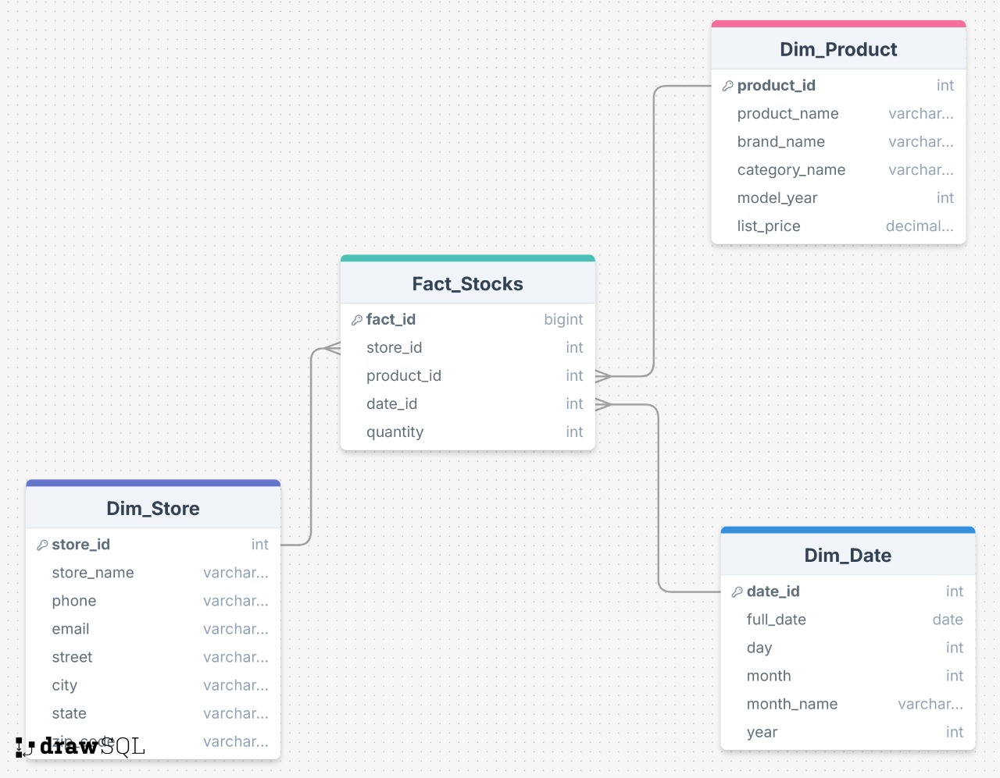

# Bike Store Data Warehouse

Kelompok 1 Mata Kuliah Business Intelligence - TI 3C - Polinema 2025/2026

## Deskripsi Proyek
Proyek ini merupakan implementasi Data Warehouse untuk sistem penjualan toko sepeda (Bike Store) menggunakan skema bintang (Star Schema). Data Warehouse ini dirancang untuk mendukung analisis bisnis dan pengambilan keputusan.

## Sumber Dataset
Dataset yang digunakan dalam proyek ini berasal dari Kaggle:
- **Nama Dataset**: Bike Store Sample Database
- **Sumber**: [Kaggle - Bike Store Sample Database](https://www.kaggle.com/datasets/dillonmyrick/bike-store-sample-database)
- **Author**: Dillon Myrick

Dataset ini berisi data transaksi penjualan toko sepeda yang mencakup informasi produk, pelanggan, toko, dan penjualan.

## Star Schema

### Dimensi
- **Dim_Date**: Dimensi waktu yang berisi informasi tanggal, bulan, tahun, kuartal
- **Dim_Product**: Dimensi produk yang berisi informasi detail produk, kategori, dan merek
- **Dim_Store**: Dimensi toko yang berisi informasi lokasi toko

### Fact Table
- **Fact_Stocks**: Tabel fakta yang berisi data transaksi stocks dengan foreign key ke dimensi-dimensi terkait

## Teknologi
- **Database**: MySQL
- **ETL Tool**: Pentaho Data Integration
- **Transformasi**: `.ktr` files untuk ETL proses

## File Struktur
- `bike_store.sql`: Script SQL untuk membuat database
- `Dim_Date.ktr`: Transformasi ETL untuk dimensi Date
- `dim_product.ktr`: Transformasi ETL untuk dimensi Product
- `dim_store.ktr`: Transformasi ETL untuk dimensi Store
- `fact_stocks.ktr`: Transformasi ETL untuk fakta stocks
